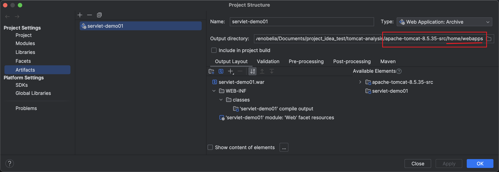

1. 设置主类：`org.apache.catalina.startup.Bootstrap`
2. 设置VM参数

   ```properties
   -Dcatalina.home=/Users/stevenobelia/Documents/project_idea_test/tomcat-analysis/apache-tomcat-8.5.35-src/home
   -Dcatalina.base=/Users/stevenobelia/Documents/project_idea_test/tomcat-analysis/apache-tomcat-8.5.35-src/home
   -Djava.io.tmpdir=/Users/stevenobelia/Documents/project_idea_test/tomcat-analysis/apache-tomcat-8.5.35-src/home/temp
   -Djava.util.logging.manager=org.apache.juli.ClassLoaderLogManager
   -Djava.util.logging.config.file=/Users/stevenobelia/Documents/project_idea_test/tomcat-analysis/apache-tomcat-8.5.35-src/home/conf/logging.properties
   ```

3. 制作 servlet-demo01.war

   1. 添加tomcat类库依赖，以至于编译当前`servlet-demo01`不至于报错，选择`Modules`->`servlet-demo01`->`Dependencies +`->`2 Library`->`Application Server Libraries`->`选择一个tomcat`
   2. 制作 artifacts，别且设置输出路径到源码下/home/webapps
      
      
   
   3. idea主菜单`Build -> Build Artifacts -> Build` 执行后可以看到`apache-tomcat-8.5.35-src/home/webapps/servlet-demo03.war`.


> [!CAUTION] 
> 源代码中修改过 `org.apache.catalina.startup.ContextConfig.configureStart`，添加了一句 `context.addServletContainerInitializer(new JasperInitializer() ,null);`